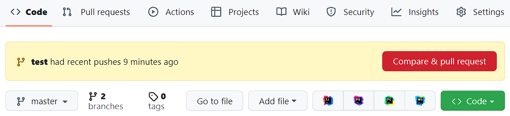
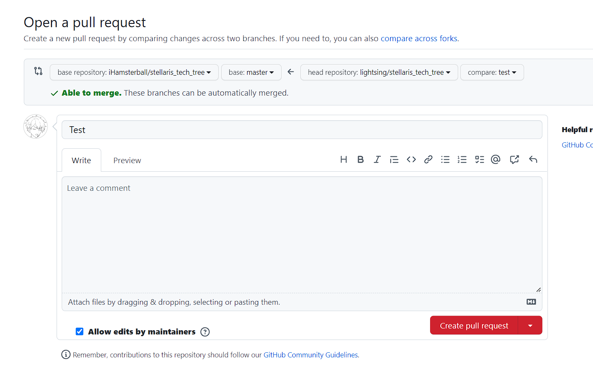

# be-careful-when-pr

Give you a visually warning when you are creating pr across forks.

### 1. Recently pushed

This will warn you if the button will lead you to pr to other repo. 

### 2. When Creating PR

It will also warn you when you are opening pr to other repos.

